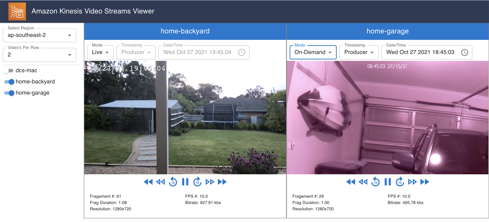
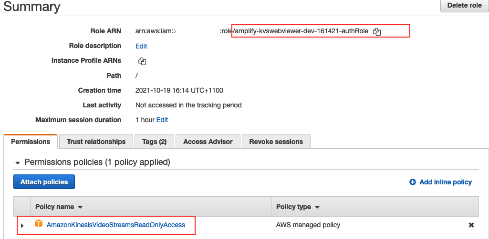
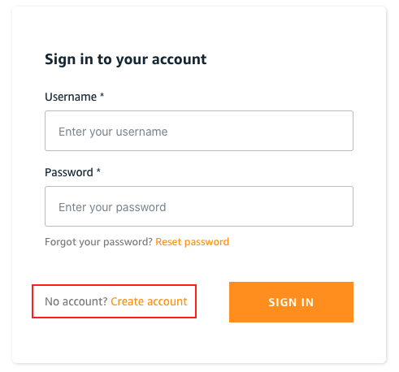

# Amazon Kinesis Video Streams Web Viewer

The Amazon Kinesis Video Streams Web Viewer is an AWS hosted web application with authenticated access to display and view AWS Kinesis Video Streams. 

A live demonstration of this application is available at: https://dev.d1c69kb8wg9cq7.amplifyapp.com/
* User authentication is enabled so you will need to complete the Sign-Up procedure to gain access.
* Demonstration test video sources are available to view by selecting the **us-east-1** region

**Amazon Kinesis Video Stream Web Viewer:**


**Supported Features:**
* Managed user authentication and access (Backed by AWS Cognito),
* Supports multiple Kinesis Video Streams displayed simultaneously,
* Automatically refreshes HLS URL if it expires,
* Fast-Forward / Rewind controls integrated to Kinesis Video Streams to automatically request media at given timestamp. 

## Deployment Guide

The AWS Kinesis Video Web Viewer is a React based web application that is deployed in AWS using AWS Amplify to automate serverless public web hosting and Amazon Cognito backed user authentication.

### Prerequisites

The following procedure assumes you are on a supported Linux or MacOS device and have installed:

* Node: v10.16.x or greater
* NPM: v6.13.x or greater
* Git: v2.23.0 or greater

You will also need:
* Access to an AWS Account: [Create and Activate a new AWS Account](https://aws.amazon.com/premiumsupport/knowledge-center/create-and-activate-aws-account/).
* AWS credential profile configured: [Configure CLI Credential File](https://docs.aws.amazon.com/cli/latest/userguide/cli-configure-files.html)

### Deploying the Kinesis Video Stream Web Application to AWS

1) **Clone the Kinesis Video Stream Web Viewer Project:**
```
git clone https://github.com/aws-samples/amazon-kinesis-video-streams-web-viewer.git
cd amazon-kinesis-video-streams-web-viewer
```

2) **Install the application dependencies:**
```
npm install
```

3) **Install AWS Amplify:**
If you don’t already have the AWS Amplify CLI toolset installed, do so as per below.
```
npm install -g @aws-amplify/cli
```

4) **Initialize AWS Amplify in this project:**

* Initialize AWS Amplify in the project directory.
```
amplify init
```

**Provide the below responses to the initialization questions:**

**Note:** In the below, ensure the selected **AWS profile** has a default AWS Region specified to determine where the application will be deployed. 

? Enter a name for the project: **KvsWebViewer**  
? Initialize the project with the above configuration? **Y**  
? Select the authentication method you want to use: **AWS profile**  
? Please choose the profile you want to use: **[Select Preferred AWS Profile]**  

5) **Add AWS Cognito Backed User Authentication:**
```
amplify add auth
```

**Provide the below responses to the Add Auth configuration questions:**
 
? Do you want to use the default authentication and security configuration? **Default configuration**  
? How do you want users to be able to sign in? **Email**  
? Do you want to configure advanced settings? **No, I am done.**  

6) **Add serverless Web Hosting using AWS Amplify:**

* Initialize AWS Amplify in the project directory.
```
amplify add hosting
```

**Provide the below responses to the Add Hosting configuration questions:**
 
? Select the plugin module to execute: **Hosting with Amplify Console**  
? Choose a type: **Manual deployment**  

7) **Publish the Kinesis Video Stream Viewer Application using AWS Amplify:**

```
amplify publish
```

**Provide the below responses to the Amplify Publish configuration questions:**
 
? Are you sure you want to continue? **Yes**  

### You're nearly there!
At this point, AWS Amplify has built the project files, published them to be hosted in AWS and will deploy and configure AWS Cognito to provide identity management and resource access. This process can take a few minutes to complete.   

When done, you will see a message similar to the below:
```
✔ Zipping artifacts completed.
✔ Deployment complete!
https://dev.123456abcdef.amplifyapp.com
```

The URL provided is the public address of your hosted Amazon Kinesis Video Stream Web Viewer application. Record the URL, we will need it after just a few more steps. 

### Update the AWS Cognito Authenticated Role.

AWS Amplify deployed an AWS Cognito instance with an Authenticated IAM Role that provides access to AWS services for users that are successfully authenticated in the application. We need to allow these users Read-Only access to Kinesis Video Streams so that they have access the media available in your AWS Account. 

1) Open the [Amazon IAM Roles Console](https://console.aws.amazon.com/iamv2/home?#/roles) 
* Search for the role that is similar to **amplify-kvswebviewer-dev-123456-authRole** and click on it.
    * **Note:** don't select the similar role ending with **-idp**.
* Click **Attach policies**, search for and select **AmazonKinesisVideoStreamsReadOnlyAccess** policy.
* Click **Attach Policy** to confirm. 



### Manually Add Initial User Credentials.
AWS Amplify used to build and deploy this project has the ability to provide an on-line user Sign-Up experience to 
add new credentials to the application. In this case however, we don't want to manage or expose the user Sign-Up capability to the Internet so will instead add an initial user manually in the Amazon Coginto User Pool created for this application.

* Go to  the [Amazon Coginto Console](https://.console.aws.amazon.com/cognito) and select the AWS region you deployed this project in. 
* Click on **Manage User Pools** and select the User Pool created for this project that starts with **kvswebviewer**
* In the User Pool, select **Users and Groups** from the menu on the left then click **Create User**
* Add the:
    * Username (must be a valid email address)

### And That’s it!
Go to the URL that was generated earlier, you will see a Sign In page:



* Click **Create Account** in the first instance to Sign Up as new user.
* Follow the instructions and validate your e-mail address. This will be registered in AWS Cognito.
* Log into the console and you will now be in the Amazon Kinesis Video Stream Web Viewer. Follow the Quick-Start guide there to access Kinesis Video Streams media in the web application.

**Note:** At any time you need to find the URL again just visit the AWS [Amplify Console](https://console.aws.amazon.com/amplify/) in your region and select the **KvsWebViewer** project **Frontend Environments** that was created for you.

## FAQs

**How many media streams can be viewed at once?**  
The only limitation is the available bandwidth and the capability of the physical device. The **Media Telemetry** section shows the current bitrate for each media stream being displayed. Be aware of the total bandwidth being consumed as this impacts cost of the Amazon Kinesis Video service and can use significant bandwidth on the local network. If the local network can't support the requested bandwidth, the media display will be degraded.  

**How much bandwidth is consumed per stream?**  
This depends on the resolution and frame rate that the media stream was uploaded into Amazon Kinesis Video Streams. To reduce the bandwidth of each stream, you need to limit the video metrics of the ingested media.  

**Why does my Kinesis Video Stream show a 'No Media Available Error'?**  
You will get this when requesting media at a time that none has been uploaded to Amazon Kinesis Video Streams. This will occur for example, if Live mode is selected but there is no media currently being uploaded to the Kinesis Video Stream or if in On-Demand mode and requesting a Date/Time before the stream was created.  

**Why does my Date/Time jump forward when I request a new On-Demand time?**  
If you request media for a Date/Time that has no media available, Amazon Kinesis video Streams will search to find the next available media and return that which is why the requested Date/Time may sometimes jump forward for returned media.  

**Can I view Amazon Kinesis Video Streams from multiple AWS Regions at the same time?**  
To avoid complexity in the user interface, a single instance of the Amazon Kinesis Video Streams Viewer can only display media streams from a single AWS region. You are able to open multiple tabs / browsers to the Amazon Kinesis Video Streams Viewer that display media from separate AWS Regions. In this case, be aware of the amount of bandwidth being consumed as this impacts cost of the Amazon Kinesis Video service and can use significant bandwidth on the local network.  

**Why Does the media re-buffer often when in On-Demand Mode?**  
If in On-Demand mode and the requested time is very close to the current time it will continuously reach the end of the 
available fragments and request the next media stream. To avoid this, use Live Mode if tracking the live edge of the media stream. 

**Can I refresh the Kinesis Video Streams list?**  
Yes, instead of taking real-estate on the UI with a refresh button, you can just re-select the AWS Region and the Kinesis Video Streams list will be updated.  

## FAQs: For the Developers:

**How is media requested from Amazon Kinesis Video Streams and rendered in the user interface?**  
This application requests and displays the Amazon Kinesis Video Streams media via a [HLS URL request](https://docs.aws.amazon.com/kinesisvideostreams/latest/dg/API_reader_GetHLSStreamingSessionURL.html). The application requests a HLS URL from Amazon Kinesis Video Streams and plays in the browser using [React-Player](https://www.npmjs.com/package/react-player) 
which by default loads [HLS.js](https://github.com/video-dev/hls.js/) to display HLS URL based media.

**Can I fine tune he HLS.js media player configurations like buffer and latency settings?**  
Yes, the full HLS.js config is injected into the application from the [hlsConfigs](src/assets/data/hlsConfigs.js) properties file. Details of the HLS.js config can be found in the [HLS.js API fine-tuning](https://github.com/video-dev/hls.js/blob/master/docs/API.md#fine-tuning) page.

**Can I customise or use this application in my own project?**  
Yes, this application is released under the MIT-0 open-source license. Subject to the requirements of that license, you may 
use and modify the source code for your own requirements.  

This application tries to find a balance between modularity and keeping the code simple and readable for developers of all 
levels. Using this approach, the Amazon Kinesis Video Streams viewer is contained within the **KvsPlayerFrame** component.
This component has all the logic required to interface to Amazon Kinesis Video Streams and display the requested media. To 
import an individual stream viewer into your project, copy this component and all its dependencies.  

**Can I use this media viewer on a mobile device?**
Yes, this web application uses a responsive design that will render on mobile devices but for best results is intended for mid to large screen devices.  

The ability to select **'Video's per Row'** goes against responsive web design but allows the user to choose a setting that is best suited to the screen size and display requirements.
